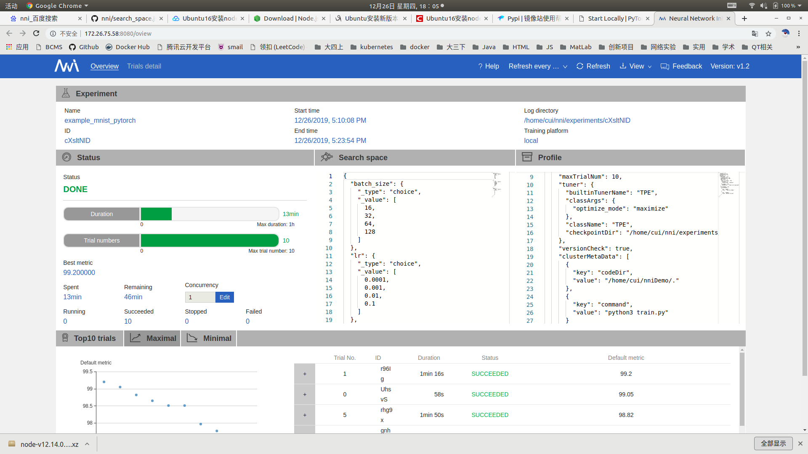

# 微软 Netural Network Intelligence(NNI)

## 简介

NNI是微软在2018年开源的工具包，可以有效的帮助用户自动化调参。NNI具有如下的特点：

+ **易于使用**：NNI通过pip安装，无需进行复杂环境配置；NNI支持所有主流机器学习框架（Pytorch，TensorFlow，Keras，MXNet）；使用NNI只需要对代码进行简单修改；NNI有详细的文档；
+ **高效**：NNI内置了丰富的调参算法和终止算法，可以根据当前参数运行效果的反馈来**调整搜索方向，加速调参过程**。当判定不会出现更好的参数时，可以终止（也可以一直搜索）。

NNI中有如下几个重要的概念：

* **Experiment（实验）**：实验是一次找到模型的最佳超参组合，或最好的神经网络架构的任务。 它由 Trial 和自动机器学习算法所组成。

* **搜索空间**：是模型调优的范围。 例如，超参的取值范围。

* **Configuration（配置）**：配置是来自搜索空间的一个参数实例，每个超参都会有一个特定的值。

* **Trial**: Trial 是一次尝试，它会使用某组配置（例如，一组超参值，或者特定的神经网络架构）。 Trial 会基于提供的配置来运行。

* **Tuner**: Tuner 是一个自动机器学习算法，会为下一个 Trial 生成新的配置。 新的 Trial 会使用这组配置来运行。

* **Assessor**：Assessor 分析 Trial 的中间结果（例如，测试数据集上定期的精度），来确定 Trial 是否应该被提前终止。

* **训练平台**：是 Trial 的执行环境。 根据 Experiment 的配置，可以是本机，远程服务器组，或其它大规模训练平台（如，OpenPAI，Kubernetes）。

## NNI中自动化调参的用法

### 1. 安装

``` shell
python -m pip install --upgrade nni
```

### 2. 使用

#### 2.1 定义参数空间

NNI中参数空间的定义由一个JSON文件指定，一个简单的参数空间文件定义如下：

``` json
//search_space.json
{
    "epoch": {
        "_type": "choice",
        "_value": [1,5,10,15,20]
    },
    "lr": {
        "_type": "choice",
        "_value": [0.1,0.01,0.001,0.0001]
    },
    "bz": {
        "_type": "choice",
        "_value": [8,16,32,64,128]
    }
}
```

每个参数都是由<参数名> : <参数定义>定义的。参数定义中有两个属性，分别是<code>\_type</code>和<code>\_value</code>

<code>\_type</code>的常用取值和定义

<table>
  <tr>
    <th width='100px'>取值</th>
    <th>含义</th>
  </tr>
  <tr>
    <td>choice</td>
    <td>枚举类型，从_value所指定的空间中选取一个</td>
  </tr>
  <tr>
    <td>randint</td>
    <td>随机整数，此时_value应该为[lower, upper], 给出参数的范围</td>
  </tr>
  <tr>
    <td>uniform</td>
    <td>均匀分布，此时_value应该为[lower, upper], 给出参数的范围</td>
  </tr>

此外还可以有quniform，loguniform， normal等取值，代表生成的参数应该满足某个分布。

#### 2.2 修改代码

修改代码，让训练程序从NNI获取超参数，并将训练结果反馈给NNI

``` python
# coding:utf-8
import nni

def main(params):
    cnn = CNN()
    if torch.cuda.is_available():
        print("Use GPU")
        cnn = cnn.cuda()
    # 参数 训练次数 Tenser大小 学习率 损失函数 优化函数
    epoch_times = params.get('epoch')
    learning_rate = params.get('lr')
    batch_size = params.get('bz')
    for epoch in range(epoch_times):
        # 训练
        cnn.train()
        ...
        # 验证
        cnn.eval()
        ...
    accuracy = 100 * float(correct) / float(total)
    # 将结果反馈给NNI
    nni.report_final_result(accuracy)

if __name__ == '__main__':
    # params = {'epoch':5, 'lr':0.1, 'bz':32}
    # 改为从NNI获取超参数
    params = nni.get_next_parameter()
    main(params)
    

```


#### 2.3 定义配置文件

定义一个yml格式的配置文件，在里面声明搜索空间、训练指令、以及其他信息：如使用的调优算法，最大尝试次数，最大运行时间等。

``` yaml
# config.yml
authorName: czh
experimentName: example_mnist
trialConcurrency: 1
maxExecDuration: 2h
maxTrialNum: 20
#choice: local, remote, pai
trainingServicePlatform: local
searchSpacePath: search_space.json
#choice: true, false
useAnnotation: false
tuner:
  #choice: TPE, Random, Anneal, Evolution, BatchTuner, MetisTuner, GPTuner
  #SMAC (SMAC should be installed through nnictl)
  builtinTunerName: TPE
  classArgs:
    #choice: maximize, minimize
    optimize_mode: maximize
trial:
  command: python3 train.py
  codeDir: .
  gpuNum: 1
localConfig:
  useActiveGpu: true
```

这里设定最多尝试20次，使用TPE调优算法，目标是最大化准确率。

#### 2.4 运行

``` shell
user$ nnictl create -c config.yml -p 9999
INFO: expand searchSpacePath: search_space.json to /root/nni/search_space.json 
INFO: expand codeDir: . to /root/nni/. 
INFO: Starting restful server...
INFO: Successfully started Restful server!
INFO: Setting local config...
INFO: Successfully set local config!
INFO: Starting experiment...
INFO: Successfully started experiment!
------------------------------------------------------------------------------------
The experiment id is gQoDo8dD
The Web UI urls are: http://127.0.0.1:9999   http://114.212.81.50:9999   http://192.168.10.111:9999   http://10.1.10.10:9999   http://192.168.122.1:9999   http://172.17.0.1:9999
------------------------------------------------------------------------------------

You can use these commands to get more information about the experiment
------------------------------------------------------------------------------------
         commands                       description
1. nnictl experiment show        show the information of experiments
2. nnictl trial ls               list all of trial jobs
3. nnictl top                    monitor the status of running experiments
4. nnictl log stderr             show stderr log content
5. nnictl log stdout             show stdout log content
6. nnictl stop                   stop an experiment
7. nnictl trial kill             kill a trial job by id
8. nnictl --help                 get help information about nnictl
------------------------------------------------------------------------------------
Command reference document https://nni.readthedocs.io/en/latest/Tutorial/Nnictl.html
------------------------------------------------------------------------------------
```

运行成功后，本地会生成一个Web服务，可以方便的使用Web UI监控调参情况：




## NNI代码初步阅读

NNI的体系结构为：


我们主要关注它的调优部分，可以看到它的调优部分的核心是由Tuner和Assessor两个类协作完成。

+ Tuner选择一组参数，生成一个任务提交给训练平台运行。
+ 训练结束后，训练平台将度量指标返回给NNI Core，然后Tuner根据得到的反馈调整搜索方向，加速调参过程。Assessor是可选的，用来判定结果是否已经足够好，来进行提前终止。


### Tuner

在NNI SDK中，Tunner是一个抽象基类，它需要我们实现如下三个方法：

``` python
# Copyright (c) Microsoft Corporation.
# Licensed under the MIT license.


class Tuner(Recoverable):

    def generate_parameters(self, parameter_id, **kwargs):
        raise NotImplementedError('Tuner: generate_parameters not implemented')


    def receive_trial_result(self, parameter_id, parameters, value, **kwargs):
        raise NotImplementedError('Tuner: receive_trial_result not implemented')


    def update_search_space(self, search_space):
        raise NotImplementedError('Tuner: update_search_space not implemented')


```

+ update_search_space：更新参数空间，NNI推荐Tuner的实现应该可以动态更新参数空间。实际使用中会用来初始化参数空间。
+ generate_parameters：选择一组超参数并以dict的方式返回，需要的参数为parameter_id：int作为这一组参数的全局标识。这个id在反馈度量标准的时候会用到。
+ receive_trail_result：反馈某一组参数的训练结果。

使用的一个例子：

``` python
if __name__ == '__main__':
    tuner = HyperoptTuner(algorithm_name='tpe', optimize_mode='maximize')
    search_space = {
        'lr': {'_type': 'choice', '_value': [0.1, 0.01, 0.001, 0.0001, 0.00001]},
        'batch_size': {'_type': 'choice', '_value': [16, 32, 64, 128]},
        'epoch': {'_type': 'choice', '_value': [1, 3, 5, 7, 9]},
        'dropout': {'_type': 'uniform', '_value':[0, 1]}
    }
    tuner.update_search_space(search_space)
    for i in range(5):
        params = tuner.generate_parameters(i)
        print(params)
        dummy_result = random.uniform(0, 1)
        print('dummy result: %0.2f' % dummy_result)
        tuner.receive_trial_result(i, params, dummy_result)
'''
{'lr': 1e-05, 'batch_size': 128, 'epoch': 9, 'dropout': 0.7152185397939662}
dummy result: 0.04
{'lr': 0.01, 'batch_size': 64, 'epoch': 3, 'dropout': 0.1931786101096048}
dummy result: 0.29
{'lr': 0.0001, 'batch_size': 128, 'epoch': 9, 'dropout': 0.10897866399797518}
dummy result: 0.45
{'lr': 1e-05, 'batch_size': 128, 'epoch': 9, 'dropout': 0.9369304163616936}
dummy result: 0.18
{'lr': 0.01, 'batch_size': 64, 'epoch': 5, 'dropout': 0.35074203623620737}
dummy result: 0.75
'''
```


NNI提供了很多Tuner的实现，同时也支持支持自己实现Tuner

| Tuner（调参器）                               | 算法简介                                                     |
| --------------------------------------------- | ------------------------------------------------------------ |
| [**TPE**](#TPE)                               | Tree-structured Parzen Estimator (TPE) 是一种 sequential model-based optimization（SMBO，即基于序列模型优化）的方法。 SMBO 方法根据历史指标数据来按顺序构造模型，来估算超参的性能，随后基于此模型来选择新的超参。 [参考论文](https://papers.nips.cc/paper/4443-algorithms-for-hyper-parameter-optimization.pdf) |
| [**Random Search（随机搜索）**](#Random)      | 在超参优化时，随机搜索算法展示了其惊人的简单和效果。 建议当不清楚超参的先验分布时，采用随机搜索作为基准。 [参考论文](http://www.jmlr.org/papers/volume13/bergstra12a/bergstra12a.pdf) |
| [**Anneal（退火算法）**](#Anneal)             | 这种简单的退火算法从先前的采样开始，会越来越靠近发现的最佳点取样。 此算法是随机搜索的简单变体，利用了反应曲面的平滑性。 退火率不是自适应的。 |
| [**Naïve Evolution（进化算法）**](#Evolution) | Naïve Evolution（朴素进化算法）来自于 Large-Scale Evolution of Image Classifiers。 它会基于搜索空间随机生成一个种群。 在每一代中，会选择较好的结果，并对其下一代进行一些变异（例如，改动一个超参，增加或减少一层）。 Naïve Evolution 需要很多次 Trial 才能有效，但它也非常简单，也很容易扩展新功能。 [参考论文](https://arxiv.org/pdf/1703.01041.pdf) |
| [**SMAC**](#SMAC)                             | SMAC 基于 Sequential Model-Based Optimization (SMBO，即序列的基于模型优化方法)。 它利用使用过的结果好的模型（高斯随机过程模型），并将随机森林引入到 SMBO 中，来处理分类参数。 SMAC 算法包装了 Github 的 SMAC3。 注意：SMAC 需要通过 `nnictl package` 命令来安装。 [参考论文，](https://www.cs.ubc.ca/~hutter/papers/10-TR-SMAC.pdf) [Github 代码库](https://github.com/automl/SMAC3) |
| [**Batch Tuner（批量调参器）**](#Batch)       | Batch Tuner 能让用户简单的提供几组配置（如，超参选项的组合）。 当所有配置都执行完后，Experiment 即结束。 Batch Tuner 仅支持 choice 类型。 |
| [**Grid Search（遍历搜索）**](#GridSearch)    | Grid Search 会穷举定义在搜索空间文件中的所有超参组合。 遍历搜索可以使用的类型有 choice, quniform, randint。 |
| [**Hyperband**](#Hyperband)                   | Hyperband 试图用有限的资源来探索尽可能多的组合，并发现最好的结果。 它的基本思路是生成大量的配置，并使用少量的资源来找到有可能好的配置，然后继续训练找到其中更好的配置。 [参考论文](https://arxiv.org/pdf/1603.06560.pdf) |
| [**Network Morphism**](#NetworkMorphism)      | Network Morphism 提供了深度学习模型的自动架构搜索功能。 每个子网络都继承于父网络的知识和形态，并变换网络的不同形态，包括深度，宽度，跨层连接（skip-connection）。 然后使用历史的架构和指标，来估计子网络的值。 然后会选择最有希望的模型进行训练。 [参考论文](https://arxiv.org/abs/1806.10282) |
| [**Metis Tuner**](#MetisTuner)                | 大多数调参工具仅仅预测最优配置，而 Metis 的优势在于有两个输出：(a) 最优配置的当前预测结果， 以及 (b) 下一次 Trial 的建议。 它不进行随机取样。 大多数工具假设训练集没有噪声数据，但 Metis 会知道是否需要对某个超参重新采样。 [参考论文](https://www.microsoft.com/en-us/research/publication/metis-robustly-tuning-tail-latencies-cloud-systems/) |
| [**BOHB**](#BOHB)                             | BOHB 是 Hyperband 算法的后续工作。 Hyperband 在生成新的配置时，没有利用已有的 Trial 结果，而本算法利用了 Trial 结果。 BOHB 中，HB 表示 Hyperband，BO 表示贝叶斯优化（Byesian Optimization）。 BOHB 会建立多个 TPE 模型，从而利用已完成的 Trial 生成新的配置。 [参考论文](https://arxiv.org/abs/1807.01774) |
| [**GP Tuner**](#GPTuner)                      | Gaussian Process（高斯过程） Tuner 是序列化的基于模型优化（SMBO）的方法，并使用了高斯过程来替代。 [参考论文](https://papers.nips.cc/paper/4443-algorithms-for-hyper-parameter-optimization.pdf)，[Github 库](https://github.com/fmfn/BayesianOptimization) |
| [**PPO Tuner**](#PPOTuner)                    | PPO Tuner 是基于 PPO 算法的强化学习 Tuner。 [参考论文](https://arxiv.org/abs/1707.06347) |


## 参考

[NNI 官方文档](https://nni.readthedocs.io/en/latest/Overview.html)

[NNI 代码仓库](https://github.com/microsoft/nni)

